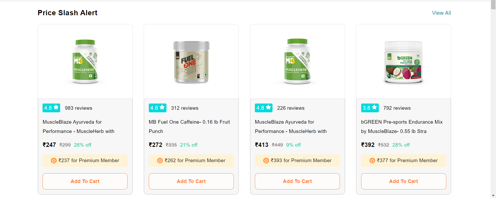
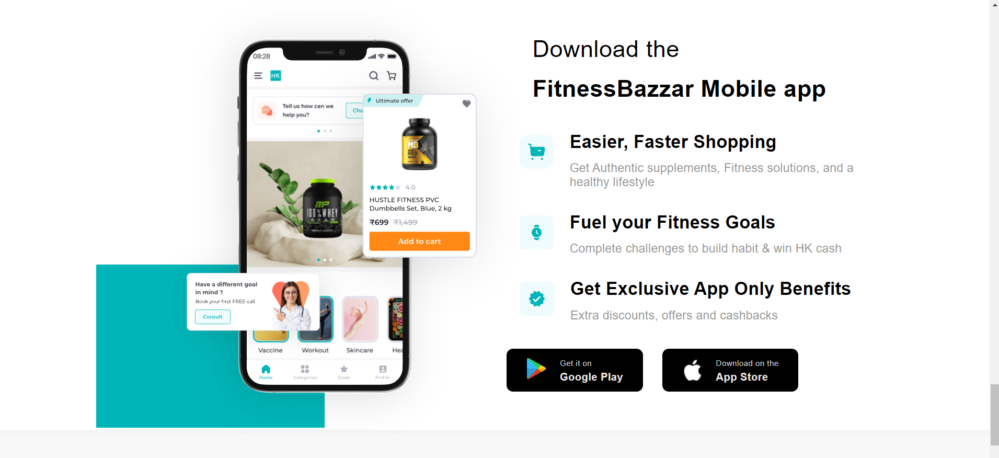
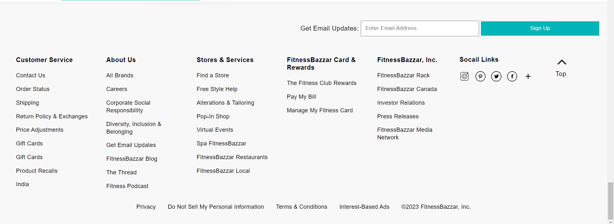
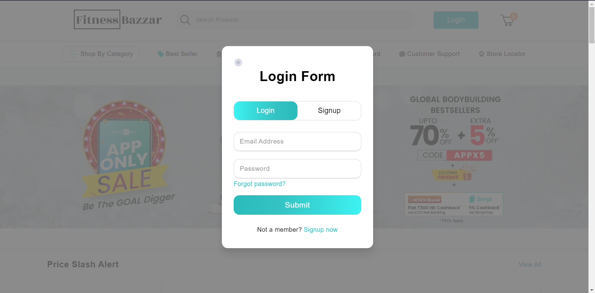
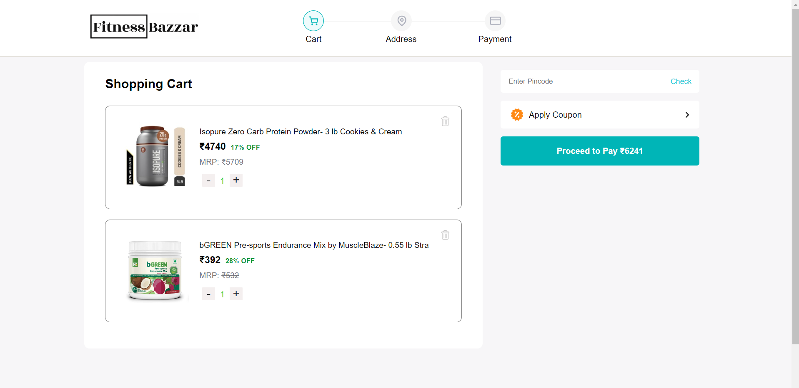

# FitnessBazzar

This is a clone of the Indian online marketplace for health and wellness products, HealthKart. The aim of this clone is to provide a similar platform for consumers to access high-quality health and wellness products.

## Features

The FitnessBazzar offers the following features:

- User Registration: Users can register on the platform to create an account.
- Product Categories: Users can browse and search for products by category.
- Product Details: Users can view product details, including images, descriptions, and prices.
- Add to Cart: Users can add products to their cart for purchase.
- Checkout: Users can proceed to the checkout process, where they can review their order, select a shipping method, and enter their payment information.

## Technologies Used

The FitnessBazzar is built using the following technologies:

- Front-end: HTML, CSS, JavaScript
- Back-end: Node.js, Express.js 
- Database: MongoDB 

## Getting Started

To get started with the FitnessBazzar, follow these steps:

1. Clone the repository to your local machine.
2. Install the required dependencies using `npm install`.
3. Start the development server using `npm start`.
4. Access the application at `http://localhost:8080`.

## Conclusion

The FitnessBazzar aims to provide a similar platform for consumers to access high-quality health and wellness products. With its intuitive user interface and comprehensive features, the clone offers a convenient and reliable platform for users to shop for their health and wellness needs.

## Headers

## Product Look

## Download App

## Footer

## Login Page

## Cart Page

